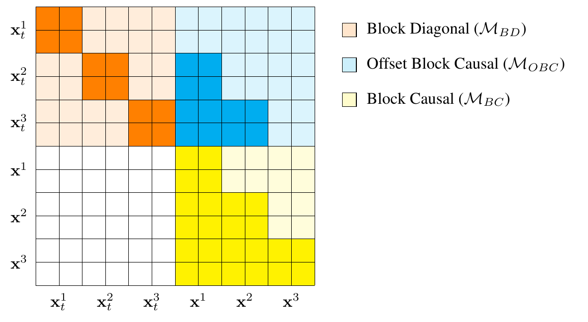

## 🧮 Proofs

<!-- Translation of Appendix A and B.1–B.6, conference PDF pp. 17–21. Original equations (11)–(24) map to (A.1)–(A.14); the four attention-mask definitions map to (A.15)–(A.18). The source notation and derivation steps are retained. -->

**Block Diffusion 将来自数据分布 $`q(\mathbf{x})`$ 的序列 $`\mathbf{x}^{1:L}=[\mathbf{x}^{1},\ldots,\mathbf{x}^{L}]`$ 划分为 $`B`$ 个长度为 $`L'`$ 的块，在每个块内执行 $`T`$ 步离散扩散，由此得到块扩散参数化下的负证据下界。**

- 为简化记号，将序列记为 $`\mathbf{x}`$。以 $`D_{\mathrm{KL}}[\cdot]`$ 表示 Kullback–Leibler 散度，$`t`$、$`s`$ 分别表示 $`t(i)=i/T`$ 和 $`s(i)=(i-1)/T`$，其中 $`i\in[1,T]`$。附录 A 给出的推导为

```math
\begin{aligned}
-\log p_\theta(\mathbf{x})
&=-\sum_{b=1}^{B}\log p_\theta(\mathbf{x}^{b}\mid\mathbf{x}^{<b})\\
&=-\sum_{b=1}^{B}\log\mathbb{E}_{q}
\frac{p_\theta(\mathbf{x}_{t(1):t(T)}^{b}\mid\mathbf{x}^{<b})}{q(\mathbf{x}_{t(1):t(T)}^{b}\mid\mathbf{x}^{b})}\\
&=-\sum_{b=1}^{B}\log\mathbb{E}_{q}
\frac{p_\theta(\mathbf{x}_{t(T)}^{b}\mid\mathbf{x}^{<b})\prod_{i=1}^{T}p_\theta(\mathbf{x}_{s(i)}^{b}\mid\mathbf{x}_{t(i)}^{b},\mathbf{x}^{<b})}{\prod_{i=1}^{T}q(\mathbf{x}_{t(i)}^{b}\mid\mathbf{x}_{s(i)}^{b})}\\
&\leq\sum_{b=1}^{B}\Bigl[
\underbrace{-\mathbb{E}_{q}\log p_\theta(\mathbf{x}^{b}\mid\mathbf{x}_{t=1/T}^{b},\mathbf{x}^{<b})}_{\mathcal{L}_{\mathrm{recons}}}\\
&\qquad+\underbrace{\mathbb{E}_{t\in\{2/T,\ldots,(T-1)/T,1\}}\mathbb{E}_{q}\,T\,D_{\mathrm{KL}}\!\left(q(\mathbf{x}_{s}^{b}\mid\mathbf{x}_{t}^{b},\mathbf{x}^{b})\,\middle\|\,p_\theta(\mathbf{x}_{s}^{b}\mid\mathbf{x}_{t}^{b},\mathbf{x}^{<b})\right)}_{\mathcal{L}_{\mathrm{diffusion}}}\\
&\qquad+\underbrace{D_{\mathrm{KL}}\!\left(q(\mathbf{x}_{t=1}^{b}\mid\mathbf{x}^{b})\,\middle\|\,p_\theta(\mathbf{x}_{t=1}^{b})\right)}_{\mathcal{L}_{\mathrm{prior}}}\Bigr]
\end{aligned}\tag{A.1}
```

**掩码块扩散以掩码扩散语言模型为基础，采用 Austin 等提出的掩码过程；前向过程通过扩散矩阵逐 token 加噪，逆向后验由相应的前向概率得到。**

- 对状态 $`i\in\{1,\ldots,V\}`$ 定义扩散矩阵 $`Q_t`$。噪声调度 $`\alpha_t\in[0,1]`$ 随 $`t`$ 严格递减，满足 $`\alpha_0=1`$、$`\alpha_1=0`$。以 $`m=V`$ 表示掩码索引，扩散矩阵为

```math
[Q_t]_{ij}=\begin{cases}
1,&i=j=m,\\
\alpha_t,&i=j\neq m,\\
1-\alpha_t,&j=m,\ i\neq m
\end{cases}\tag{A.2}
```

- 前向边缘分布对应的扩散矩阵 $`Q_{t\mid s}`$ 为下式，其中 $`\alpha_{t\mid s}=\alpha_t/\alpha_s`$

```math
[Q_{t\mid s}]_{ij}=\begin{cases}
1,&i=j=m,\\
\alpha_{t\mid s},&i=j\neq m,\\
1-\alpha_{t\mid s},&j=m,\ i\neq m
\end{cases}\tag{A.3}
```

- 在 D3PM 框架下，前向加噪过程独立作用于每个 token $`\ell\in\{1,\ldots,L\}`$，并通过扩散矩阵 $`Q_t\in\mathbb{R}^{V\times V}`$ 定义为

```math
q(\mathbf{x}_{t}^{\ell}\mid\mathbf{x}^{\ell})=\operatorname{Cat}\!\left(\mathbf{x}_{t}^{\ell};\overline{Q}_t\mathbf{x}^{\ell}\right),\qquad
\overline{Q}_{t(i)}=Q_{t(1)}Q_{t(2)}\cdots Q_{t(i)}\tag{A.4}
```

- 利用前向边缘分布的扩散矩阵，可以得到逆向后验 $`q(\mathbf{x}_{s}^{\ell}\mid\mathbf{x}_{t}^{\ell},\mathbf{x}^{\ell})`$。其中，$`\odot`$ 表示两个向量的 Hadamard 积

```math
q(\mathbf{x}_{s}^{\ell}\mid\mathbf{x}_{t}^{\ell},\mathbf{x}^{\ell})
=\frac{q(\mathbf{x}_{t}^{\ell}\mid\mathbf{x}_{s}^{\ell},\mathbf{x}^{\ell})q(\mathbf{x}_{s}^{\ell}\mid\mathbf{x}^{\ell})}{q(\mathbf{x}_{t}^{\ell}\mid\mathbf{x}^{\ell})}
=\operatorname{Cat}\!\left(\mathbf{x}_{s}^{\ell};\frac{Q_{t\mid s}\mathbf{x}_{t}^{\ell}\odot Q_s^{\top}\mathbf{x}^{\ell}}{(\mathbf{x}_{t}^{\ell})^{\top}Q_t^{\top}\mathbf{x}^{\ell}}\right)\tag{A.5}
```

**掩码扩散的 NELBO 可以通过 SUBS 参数化简化：将掩码类别的预测概率设为零，并直接保留已经解掩码的 token，最终得到交叉熵项的加权平均。**

- 以下沿用 Sahoo 等、Shi 等和 Ou 等的推导，先简化式（A.1）中的扩散损失 $`\mathcal{L}_{\mathrm{diffusion}}`$。由于扩散过程中的状态只有 $`\mathbf{x}_{t}^{\ell}\in\{\mathbf{x}^{\ell},\mathbf{m}\}`$，SUBS 对去噪模型施加两项约束：干净序列不含掩码，因此令 $`p_\theta(\mathbf{x}^{\ell}=\mathbf{m}\mid\mathbf{x}_{t}^{\ell})=0`$；若 $`\mathbf{x}_{t}^{\ell}\neq\mathbf{m}`$，真实后验满足 $`q(\mathbf{x}_{s}^{\ell}=\mathbf{x}_{t}^{\ell}\mid\mathbf{x}_{t}^{\ell}\neq\mathbf{m})=1`$，因此令 $`p_\theta(\mathbf{x}_{s}^{\ell}=\mathbf{x}_{t}^{\ell}\mid\mathbf{x}_{t}^{\ell}\neq\mathbf{m})=1`$
- 由此，只需近似 $`p_\theta(\mathbf{x}_{s}^{\ell}=\mathbf{x}^{\ell}\mid\mathbf{x}_{t}^{\ell}=\mathbf{m})`$。令 $`\mathbf{x}^{b,\ell}`$ 表示第 $`b`$ 个块中第 $`\ell`$ 个位置的 token，扩散损失为

```math
\begin{aligned}
\mathcal{L}_{\mathrm{diffusion}}
&=\sum_{b=1}^{B}\mathbb{E}_{t}\mathbb{E}_{q}\,T\left[D_{\mathrm{KL}}\!\left[q(\mathbf{x}_{s}^{b}\mid\mathbf{x}_{t}^{b},\mathbf{x}^{b})\,\middle\|\,p_\theta(\mathbf{x}_{s}^{b}\mid\mathbf{x}_{t}^{b},\mathbf{x}^{<b})\right]\right]\\
&=\sum_{b=1}^{B}\mathbb{E}_{t}\mathbb{E}_{q}\,T\left[\sum_{\ell=1}^{L'}D_{\mathrm{KL}}\!\left[q(\mathbf{x}_{s}^{b,\ell}\mid\mathbf{x}_{t}^{b,\ell},\mathbf{x}^{b,\ell})\,\middle\|\,p_\theta(\mathbf{x}_{s}^{b,\ell}\mid\mathbf{x}_{t}^{b},\mathbf{x}^{<b})\right]\right]\\
&=\sum_{b=1}^{B}\mathbb{E}_{t}\mathbb{E}_{q}\,T\left[\sum_{\ell=1}^{L'}\frac{\alpha_t-\alpha_s}{1-\alpha_t}\log p_\theta(\mathbf{x}^{b,\ell}\mid\mathbf{x}_{t}^{b,\ell},\mathbf{x}^{<b})\right]\\
&=\sum_{b=1}^{B}\mathbb{E}_{t}\mathbb{E}_{q}\,T\left[\frac{\alpha_t-\alpha_s}{1-\alpha_t}\log p_\theta(\mathbf{x}^{b}\mid\mathbf{x}_{t}^{b},\mathbf{x}^{<b})\right]
\end{aligned}\tag{A.6}
```

- 上式中的 $`D_{\mathrm{KL}}`$ 是第 $`b`$ 个块的离散时间扩散损失，第三步采用 Sahoo 等附录 B.1 的结果。令扩散步数 $`T\to\infty`$，以获得更紧的似然近似；此时原文使用 $`T(\alpha_t-\alpha_s)=\alpha'_t`$，得到

```math
\mathcal{L}_{\mathrm{diffusion}}=\sum_{b=1}^{B}\mathbb{E}_{t\sim[0,1]}\mathbb{E}_{q}\left[\frac{\alpha'_t}{1-\alpha_t}\log p_\theta(\mathbf{x}^{b}\mid\mathbf{x}_{t}^{b},\mathbf{x}^{<b})\right]\tag{A.7}
```

- 在连续时间情形下，Sahoo 等附录 A.2.4 表明，$`\mathbf{x}_{t(1)}^{b}\sim\lim_{T\to\infty}\operatorname{Cat}(\cdot;\mathbf{x}_{t=1/T}^{b})=\operatorname{Cat}(\cdot;\mathbf{x}^{b})`$，重建损失因此化为零

```math
\begin{aligned}
\mathcal{L}_{\mathrm{recons}}
&=-\mathbb{E}_{q}\log p_\theta(\mathbf{x}^{b}\mid\mathbf{x}_{t(1)}^{b},\mathbf{x}^{<b})\\
&=-\log p_\theta(\mathbf{x}^{b}\mid\mathbf{x}_{t(1)}^{b}=\mathbf{x}^{b},\mathbf{x}^{<b})\\
&=0
\end{aligned}\tag{A.8}
```

- 先验损失 $`\mathcal{L}_{\mathrm{prior}}=D_{\mathrm{KL}}\!\left(q(\mathbf{x}_{t=1}^{b}\mid\mathbf{x}^{b})\,\middle\|\,p_\theta(\mathbf{x}_{t=1}^{b})\right)`$ 也化为零，因为 $`\alpha_{t=1}=0`$ 保证 $`q(\mathbf{x}_{t=1}^{b}\mid\mathbf{x}^{b})=\operatorname{Cat}(\cdot;\mathbf{m})`$ 且 $`p_\theta(\mathbf{x}_{t=1}^{b})=\operatorname{Cat}(\cdot;\mathbf{m})`$。最终，目标简化为交叉熵项的加权平均

```math
\mathcal{L}_{\mathrm{BD}}(\mathbf{x};\theta)=\sum_{b=1}^{B}\mathbb{E}_{t\sim[0,1]}\mathbb{E}_{q}\left[\frac{\alpha'_t}{1-\alpha_t}\log p_\theta(\mathbf{x}^{b}\mid\mathbf{x}_{t}^{b},\mathbf{x}^{<b})\right]\tag{A.9}
```

- 上述 NELBO 不随噪声调度 $`\alpha_t`$ 的选择而改变，相关推导见 Sahoo 等附录 E.1.1

**当块大小为 $`L'=1`$、块数为 $`B=L`$ 时，每个块只生成一个 token，Block Diffusion 的 NELBO 恢复为自回归模型的负对数似然。**

- 采用 $`\alpha_t=1-t`$、$`\alpha'_t=-1`$，再展开关于前向分布的期望，可得

```math
\begin{aligned}
-\log p(\mathbf{x})
&\leq\sum_{b=1}^{L}\mathbb{E}_{t\sim[0,1]}\mathbb{E}_{q}\left[\frac{\alpha'_t}{1-\alpha_t}\log p_\theta(\mathbf{x}^{b}\mid\mathbf{x}_{t}^{b},\mathbf{x}^{<b})\right]\\
&=-\sum_{b=1}^{L}\mathbb{E}_{t\sim[0,1]}\mathbb{E}_{q}\left[\frac{1}{t}\log p_\theta(\mathbf{x}^{b}\mid\mathbf{x}_{t}^{b},\mathbf{x}^{<b})\right]\\
&=-\sum_{b=1}^{L}\mathbb{E}_{t\sim[0,1]}\frac{1}{t}\mathbb{E}_{q}\left[\log p_\theta(\mathbf{x}^{b}\mid\mathbf{x}_{t}^{b},\mathbf{x}^{<b})\right]\\
&=-\sum_{b=1}^{L}\mathbb{E}_{t\sim[0,1]}\frac{1}{t}\Bigl[q(\mathbf{x}_{t}^{b}=\mathbf{m}\mid\mathbf{x}^{b})\log p_\theta(\mathbf{x}^{b}\mid\mathbf{x}_{t}^{b}=\mathbf{m},\mathbf{x}^{<b})\\
&\hspace{11em}+q(\mathbf{x}_{t}^{b}=\mathbf{x}^{b}\mid\mathbf{x}^{b})\log p_\theta(\mathbf{x}^{b}\mid\mathbf{x}_{t}^{b}=\mathbf{x}^{b},\mathbf{x}^{<b})\Bigr]
\end{aligned}\tag{A.10}
```

- 去噪模型采用 SUBS 参数化。由于已经解掩码的 token 直接从输入复制到输出，$`\log p_\theta(\mathbf{x}^{b}\mid\mathbf{x}_{t}^{b}=\mathbf{x}^{b},\mathbf{x}^{<b})=0`$。再利用 $`q(\mathbf{x}_{t}^{b}=\mathbf{m}\mid\mathbf{x}^{b})=t`$，式（A.10）化为

```math
\begin{aligned}
-\log p_\theta(\mathbf{x})
&\leq-\sum_{b=1}^{L}\mathbb{E}_{t\sim[0,1]}\frac{1}{t}\,q(\mathbf{x}_{t}^{b}=\mathbf{m}\mid\mathbf{x}^{b})\log p_\theta(\mathbf{x}^{b}\mid\mathbf{x}_{t}^{b}=\mathbf{m},\mathbf{x}^{<b})\\
&=-\sum_{b=1}^{L}\mathbb{E}_{t\sim[0,1]}\log p_\theta(\mathbf{x}^{b}\mid\mathbf{x}_{t}^{b}=\mathbf{m},\mathbf{x}^{<b})\\
&=-\sum_{b=1}^{L}\log p_\theta(\mathbf{x}^{b}\mid\mathbf{m},\mathbf{x}^{<b})
\end{aligned}\tag{A.11}
```

**NELBO 的紧性部分比较不同块大小下的目标，原文给出的结论为：对 $`1\leq K\leq L`$，有 $`-\log p(\mathbf{x})\leq\mathcal{L}_{K}\leq\mathcal{L}_{K+1}`$。**

- 先考虑 $`K=1`$，此时恢复自回归负对数似然。原文式（22）写为

```math
\begin{aligned}
\mathcal{L}_{1}
&=\sum_{b=1}^{L}\log\mathbb{E}_{t\sim[0,1]}\mathbb{E}_{q}\frac{\alpha'_t}{1-\alpha_t}p_\theta(\mathbf{x}^{b}\mid\mathbf{x}_{t}^{b},\mathbf{x}^{<b})\\
&=-\sum_{b=1}^{L}\log p_\theta(\mathbf{x}^{b}\mid\mathbf{m},\mathbf{x}^{<b})
\end{aligned}\tag{A.12}
```

- 当块大小为 $`K=2`$ 时，原文式（23）为

```math
\mathcal{L}_{2}=\sum_{b=1}^{L/2}\log\mathbb{E}_{t\sim[0,1]}\mathbb{E}_{q}\frac{\alpha'_t}{1-\alpha_t}p_\theta(\mathbf{x}^{b}\mid\mathbf{x}_{t}^{b},\mathbf{x}^{<b})\tag{A.13}
```

- 原文先比较 $`\mathcal{L}_{1}`$ 与 $`\mathcal{L}_{2}`$，再通过归纳推广到所有 $`1\leq K\leq L`$。令 $`\mathbf{x}^{b,\ell}`$ 表示第 $`b`$ 个块中第 $`\ell\in[1,L']`$ 个位置的 token，原文式（24）的推导为

```math
\begin{aligned}
-\sum_{b=1}^{L}\log p_\theta(\mathbf{x}^{b}\mid\mathbf{m},\mathbf{x}^{<b})
&=-\sum_{b=1}^{L/2}\log\mathbb{E}_{t\sim[0,1]}\mathbb{E}_{q}\frac{1}{1-\alpha_t}p_\theta(\mathbf{x}^{b}\mid\mathbf{x}_{t}^{b},\mathbf{x}^{<b})\\
&=-\sum_{b=1}^{L/2}\log\mathbb{E}_{t\sim[0,1]}\mathbb{E}_{q}\prod_{i=1}^{2}\frac{1}{1-\alpha_t}p_\theta(\mathbf{x}^{b,\ell}\mid\mathbf{x}_{t}^{b},\mathbf{x}^{<b})\\
&=-\sum_{b=1}^{L/2}\log\prod_{i=1}^{2}\mathbb{E}_{t\sim[0,1]}\mathbb{E}_{q}\frac{1}{1-\alpha_t}p_\theta(\mathbf{x}^{b,\ell}\mid\mathbf{x}_{t}^{b},\mathbf{x}^{<b})\\
&\leq-\sum_{b=1}^{L/2}\sum_{i=1}^{2}\log\mathbb{E}_{t\sim[0,1]}\mathbb{E}_{q}\frac{1}{1-\alpha_t}p_\theta(\mathbf{x}^{b,\ell}\mid\mathbf{x}_{t}^{b},\mathbf{x}^{<b})
\end{aligned}\tag{A.14}
```

**专门设计的注意力掩码将含噪序列与干净序列拼接，使 Transformer 在一次前向传播中同时建模全部块的条件概率 $`p_\theta(\mathbf{x}^{b}\mid\mathbf{x}_{t}^{b},\mathbf{x}^{<b})`$。**

- 对所有 $`b\in[1,B]`$ 建模，需要同时处理含噪序列 $`\mathbf{x}_{t}^{b}`$ 和条件上下文 $`\mathbf{x}^{<b}`$。将两条序列拼接为 $`\mathbf{x}_{\mathrm{full}}\leftarrow\mathbf{x}_{t}\oplus\mathbf{x}`$ 并输入 Transformer，便可同时处理二者，无需调用去噪网络 $`B`$ 次
- 拼接序列包含 $`2L`$ 个 token，采用自定义注意力掩码 $`\mathcal{M}_{\mathrm{full}}\in\{0,1\}^{2L\times2L}`$ 更新其表示。完整掩码由四个 $`L\times L`$ 子矩阵构成

```math
\mathcal{M}_{\mathrm{full}}=\begin{bmatrix}\mathcal{M}_{\mathrm{BD}}&\mathcal{M}_{\mathrm{OBC}}\\\mathbf{0}&\mathcal{M}_{\mathrm{BC}}\end{bmatrix}\tag{A.15}
```

- $`\mathcal{M}_{\mathrm{BD}}`$ 与 $`\mathcal{M}_{\mathrm{OBC}}`$ 用于更新 $`\mathbf{x}_{t}`$ 的表示，$`\mathcal{M}_{\mathrm{BC}}`$ 用于更新 $`\mathbf{x}`$ 的表示。块对角掩码 $`\mathcal{M}_{\mathrm{BD}}`$ 对应含噪块 $`\mathbf{x}_{t}^{b}`$ 内的自注意力

```math
[\mathcal{M}_{\mathrm{BD}}]_{ij}=\begin{cases}1,&i,j\text{ belong to the same block},\\0,&\text{otherwise}\end{cases}\tag{A.16}
```

- 偏移块因果掩码 $`\mathcal{M}_{\mathrm{OBC}}`$ 对应对条件上下文 $`\mathbf{x}^{<b}`$ 的交叉注意力

```math
[\mathcal{M}_{\mathrm{OBC}}]_{ij}=\begin{cases}1,&j\text{ belongs to a block before }i,\\0,&\text{otherwise}\end{cases}\tag{A.17}
```

- 块因果掩码 $`\mathcal{M}_{\mathrm{BC}}`$ 用于更新 $`\mathbf{x}^{b}`$，允许访问当前块及更早的块

```math
[\mathcal{M}_{\mathrm{BC}}]_{ij}=\begin{cases}1,&j\text{ belongs to the same block as }i\text{ or an earlier block},\\0,&\text{otherwise}\end{cases}\tag{A.18}
```

- 图 3 展示序列长度 $`L=6`$、块大小 $`L'=2`$ 时的注意力掩码示例

<figure class="lake-figure" style="width:700px;font-family:var(--article-serif)">

<figcaption>Figure 3: Example Of Specialized Attention Mask</figcaption>
</figure>
