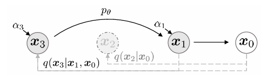

以 $`L_1`$ 为目标训练的模型，不仅适用于 DDPM 的马尔可夫推断过程，也适用于由 $`\sigma`$ 参数化的非马尔可夫前向过程。因此，可以直接使用预训练的 DDPM 模型，通过改变 $`\sigma`$ 选择符合采样需求的生成过程

**Denoising Diffusion Implicit Models：** 由前文定义的生成分布 $`p_\theta(x_{0:T})`$，对 $`t>1`$，可从 $`x_t`$ 生成 $`x_{t-1}`$

```math
x_{t-1} = \sqrt{\alpha_{t-1}}\underbrace{\left(\frac{x_t-\sqrt{1-\alpha_t}\,\epsilon_\theta^{(t)}(x_t)}{\sqrt{\alpha_t}}\right)}_{\text{predicted }x_0} + \underbrace{\sqrt{1-\alpha_{t-1}-\sigma_t^2}\,\epsilon_\theta^{(t)}(x_t)}_{\text{direction pointing to }x_t} + \underbrace{\sigma_t\epsilon_t}_{\text{random noise}}
```

- 其中，$`\epsilon_t\sim\mathcal N(0,I)`$ 是与 $`x_t`$ 独立的标准高斯噪声，并约定 $`\alpha_0:=1`$；$`t=1`$ 时使用前文定义的末端分布。不同的 $`\sigma`$ 对应不同的生成过程，但都使用同一个噪声预测模型 $`\epsilon_\theta`$，无需重新训练。当各步取 $`\sigma_t=\sqrt{\frac{1-\alpha_{t-1}}{1-\alpha_t}}\sqrt{1-\frac{\alpha_t}{\alpha_{t-1}}}`$ 时，前向过程为马尔可夫过程，生成过程对应 DDPM

- **当所有 $`\sigma_t=0`$ 时，除 $`t=1`$ 外，前向过程在给定 $`x_{t-1}`$ 和 $`x_0`$ 后是确定性的；生成过程中的随机噪声项也随之消失**。此时，模型通过固定映射将潜变量 $`x_T`$ 转换为样本 $`x_0`$，形成隐式概率模型，称为去噪扩散隐式模型（DDIM）。它沿用 DDPM 的训练目标，而对应的前向过程不再是扩散过程

### Accelerated Generation Processes

上述前向过程包含 $`T`$ 步，生成过程也相应需要执行 $`T`$ 步采样。但只要边缘分布 $`q_\sigma(x_t\mid x_0)`$ 保持不变，去噪目标 $`L_1`$ 就不依赖具体的前向过程，因此可以构造长度小于 $`T`$ 的前向过程，**无需重新训练即可缩短生成链**

- 将前向过程定义在潜变量子集 $`\{x_{\tau_1},\ldots,x_{\tau_S}\}`$ 上，其中 $`\tau`$ 是 $`[1,\ldots,T]`$ 中长度为 $`S`$ 的严格递增子序列。在这些变量上构造顺序前向过程，并保持边缘分布 $`q(x_{\tau_i}\mid x_0)=\mathcal N(\sqrt{\alpha_{\tau_i}}x_0,(1-\alpha_{\tau_i})I)`$。生成过程按 $`\operatorname{reversed}(\tau)`$ 的顺序采样，该序列称为**采样轨迹**；当其长度远小于 $`T`$ 时，所需的迭代次数显著减少

<p style="text-align: center">

</p>

- 与前文相同的论证表明，仍可使用以 $`L_1`$ 训练的模型，只需将采样更新中的相邻时间步改为所选轨迹中的相邻时间步。这一构造同时适用于 DDPM、DDIM 及上述其他生成过程，使训练步数与实际采样步数可以分别选择

**Relevance To Neural ODEs：** 将 DDIM 的确定性更新式重写为如下形式，可以看出它与求解常微分方程的 Euler 方法之间的关系

```math
\frac{x_{t-\Delta t}}{\sqrt{\alpha_{t-\Delta t}}}=\frac{x_t}{\sqrt{\alpha_t}}+\left(\sqrt{\frac{1-\alpha_{t-\Delta t}}{\alpha_{t-\Delta t}}}-\sqrt{\frac{1-\alpha_t}{\alpha_t}}\right)\epsilon_\theta^{(t)}(x_t)
```

- 重新参数化为 $`\sigma(t)=\sqrt{(1-\alpha_t)/\alpha_t}`$ 与 $`\bar x(t)=x_t/\sqrt{\alpha_t}`$，其中 $`\sigma(t)`$ 是满足 $`\sigma(0)=0`$ 的连续递增函数。这里的 $`\sigma(t)`$ 表示重参数化后的连续噪声尺度，与前文控制采样随机性的 $`\sigma_t`$ 不同。上述更新可视为以下 ODE 的 Euler 离散化

```math
d\bar x(t)=\epsilon_\theta^{(t)}\!\left(\frac{\bar x(t)}{\sqrt{\sigma(t)^2+1}}\right)d\sigma(t)
```

- 当离散步数足够多时，也可以沿相反方向从 $`t=0`$ 积分至 $`T`$，将观测样本 $`x_0`$ 编码为潜变量 $`x_T`$，从而获得与生成过程对应的潜在表示

**在噪声预测模型达到最优时，上述 ODE 与 Variance-Exploding SDE 对应的 probability flow ODE 等价，但二者采用的离散采样更新不同**。对后者按时间 $`t`$ 使用 Euler 方法，得到

```math
\frac{x_{t-\Delta t}}{\sqrt{\alpha_{t-\Delta t}}}=\frac{x_t}{\sqrt{\alpha_t}}+\frac12\left(\frac{1-\alpha_{t-\Delta t}}{\alpha_{t-\Delta t}}-\frac{1-\alpha_t}{\alpha_t}\right)\sqrt{\frac{\alpha_t}{1-\alpha_t}}\,\epsilon_\theta^{(t)}(x_t)
```

- 当 $`\alpha_t`$ 与 $`\alpha_{t-\Delta t}`$ 足够接近时，两种更新近似一致；在较少采样步数下，离散化方式会带来差异。DDIM 直接相对于 $`\sigma(t)`$ 取 Euler 步，而上述 probability flow ODE 的离散化相对于 $`t`$ 取步
