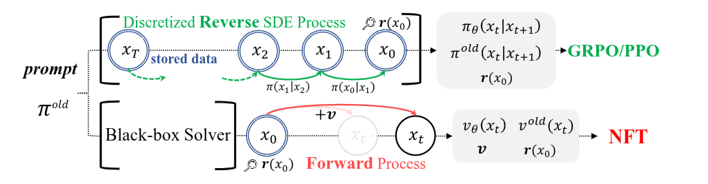
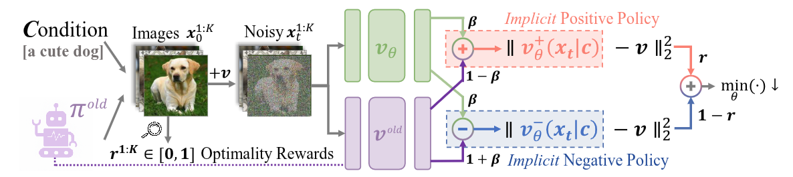

<div class="diffusion-nft-note">

# 🌿 DiffusionNFT: Online Diffusion Reinforcement With Forward Process

**DiffusionNFT 将在线强化学习中的策略更新放到前向加噪过程，通过奖励加权的正、负两项回归损失，直接训练一个改进后的生成策略。** 前文的 Flow-GRPO 利用逆向采样链的高斯转移密度构造策略目标；DiffusionNFT 则从旧策略生成的干净图像出发，重新加噪并计算流匹配损失，使训练目标与收集样本时使用的求解器解耦

- 采样阶段只需保留提示、最终图像及奖励；训练阶段重新采样时间与噪声，无需保存完整去噪轨迹，也无需计算转移密度比。正、负策略由旧模型与同一个可训练模型组合得到，强化引导直接融入模型参数



## 📡 Diffusion And Flow Models

给定干净样本 $`x_0\sim\pi_0`$ 与噪声调度 $`\alpha_t,\sigma_t`$，前向过程的条件分布为 $`\pi_{t\mid0}(x_t\mid x_0)=\mathcal N(\alpha_t x_0,\sigma_t^2I)`$。利用高斯噪声重参数化，可同时得到受噪样本及其目标速度

```math
x_t=\alpha_t x_0+\sigma_t\epsilon,\qquad
v=\dot\alpha_t x_0+\dot\sigma_t\epsilon,\qquad
\epsilon\sim\mathcal N(0,I).\tag{1}
```

- 速度网络 $`v_\theta(x_t,t)`$ 通过回归路径的切向量进行训练，其中 $`\dot\alpha_t,\dot\sigma_t`$ 表示时间导数，$`w(t)`$ 为损失权重

```math
\mathbb E_{t,\,x_0\sim\pi_0,\,\epsilon\sim\mathcal N(0,I)}
\left[w(t)\left\|v_\theta(x_t,t)-v\right\|_2^2\right].\tag{2}
```

- 生成时从噪声端出发，沿时间递减方向求解 $`\mathrm dx_t/\mathrm dt=v_\theta(x_t,t)`$。对于 Rectified Flow，$`\alpha_t=1-t`$、$`\sigma_t=t`$，因此目标速度为 $`v=\epsilon-x_0`$。DiffusionNFT 沿用这一前向回归形式，将训练样本替换为旧策略的在线生成结果，并通过奖励决定正、负损失的权重

## ⛵ Problem Setup

考虑预训练扩散策略 $`\pi^{\mathrm{old}}`$ 与提示数据集 $`\{c\}`$。每轮针对提示 $`c`$ 生成 $`K`$ 张图像 $`x_0^{1:K}`$，并用标量奖励评估各样本。先假设 $`r(x_0,c)\in[0,1]`$，将其解释为最优性概率 $`p(o=1\mid x_0,c)`$：图像以概率 $`r`$ 归入假想正样本集 $`\mathcal D^+`$，以概率 $`1-r`$ 归入负样本集 $`\mathcal D^-`$。记 $`\bar r_c=\mathbb E_{\pi^{\mathrm{old}}(\cdot\mid c)}[r(x_0,c)]`$，当 $`0<\bar r_c<1`$ 时，两类样本对应的分布为

```math
\begin{aligned}
\pi^+(x_0\mid c)
&:=\pi^{\mathrm{old}}(x_0\mid o=1,c)
=\frac{r(x_0,c)}{\bar r_c}\,\pi^{\mathrm{old}}(x_0\mid c),\\
\pi^-(x_0\mid c)
&:=\pi^{\mathrm{old}}(x_0\mid o=0,c)
=\frac{1-r(x_0,c)}{1-\bar r_c}\,\pi^{\mathrm{old}}(x_0\mid c).
\end{aligned}\tag{3}
```

- 按期望奖励比较，有 $`\pi^+\succeq\pi^{\mathrm{old}}\succeq\pi^-`$；奖励在旧策略下具有非零方差时，不等式严格成立。仅拟合正样本分布便得到拒绝采样微调（RFT），但这种方式没有利用负样本提供的改进信息。实际训练也无需将样本硬划分为两组，可以直接使用 $`r`$ 与 $`1-r`$ 作为软权重

**DiffusionNFT 同时利用正、负样本，构造相对于旧策略的强化引导方向 $`\Delta`$。** 设旧策略的速度预测器为 $`v^{\mathrm{old}}`$，期望学习的速度场写为

```math
v^*(x_t,c,t)=v^{\mathrm{old}}(x_t,c,t)+\frac1\beta\Delta(x_t,c,t),
\qquad \beta>0.\tag{4}
```

- 其中，$`1/\beta`$ 控制引导强度。接下来先确定 $`\Delta`$ 的形式，再构造能够学习这一方向的训练目标

## 🦋 Forward-Based Negative-Aware Diffusion Reinforcement

正、负分布经过同一前向扰动核后，分别对应速度场 $`v^+`$ 与 $`v^-`$。旧策略的速度场可以由二者加权组合，因此，向正策略靠近与远离负策略对应同一改进方向

<div class="nft-theorem">

**Theorem 3.1. Improvement Direction.** 设 $`v^+,v^-,v^{\mathrm{old}}`$ 分别为 $`\pi^+,\pi^-,\pi^{\mathrm{old}}`$ 对应的理想速度预测器，则

```math
\begin{aligned}
\Delta(x_t,c,t)
&=[1-\alpha(x_t)]\,[v^{\mathrm{old}}(x_t,c,t)-v^-(x_t,c,t)]\\
&=\alpha(x_t)\,[v^+(x_t,c,t)-v^{\mathrm{old}}(x_t,c,t)],\\[4pt]
\text{where}\quad\alpha(x_t)
&:=\frac{\pi_t^+(x_t\mid c)}{\pi_t^{\mathrm{old}}(x_t\mid c)}\,\bar r_c
\in[0,1].
\end{aligned}\tag{5}
```

</div>

- 这里 $`\alpha(x_t)=p(o=1\mid x_t,c)`$ 是受噪样本对应的后验最优性概率，与噪声调度 $`\alpha_t`$ 不同；记号中省略条件 $`c,t`$。由 Bayes 公式，旧策略的干净样本后验可分解为正、负后验的混合。对目标速度求条件期望，便有 $`v^{\mathrm{old}}=\alpha(x_t)v^++[1-\alpha(x_t)]v^-`$，整理即得式（5）

- 在式（4）中，若令 $`\beta=\alpha(x_t)>0`$，则 $`v^*=v^+`$，恢复正样本分布对应的策略。这说明引导方向与正策略一致；实际使用常数 $`\beta`$ 时，引导幅度仍需通过实验选择

**直接学习 $`v^+`$ 与 $`v^-`$ 需要两套模型，DiffusionNFT 改用隐式参数化，使两项损失共同更新同一个策略 $`v_\theta`$。** 在当前训练轮次内固定 $`v^{\mathrm{old}}`$，用它与 $`v_\theta`$ 的线性组合分别表示隐式正、负速度预测器

<div class="nft-theorem">

**Theorem 3.2. Policy Optimization.** 从 $`\pi^{\mathrm{old}}(x_0\mid c)`$ 采样干净图像，并按式（1）构造 $`x_t,v`$。考虑训练目标

```math
\begin{aligned}
\mathcal L_{\mathrm{NFT}}(\theta)
&=\mathbb E_{c,\,x_0\sim\pi^{\mathrm{old}}(\cdot\mid c),\,t,\,\epsilon}
\left[r\|v_\theta^+-v\|_2^2+(1-r)\|v_\theta^--v\|_2^2\right],\\[4pt]
\text{where}\quad v_\theta^+
&:=(1-\beta)v^{\mathrm{old}}+\beta v_\theta,\qquad
v_\theta^-:=(1+\beta)v^{\mathrm{old}}-\beta v_\theta.
\end{aligned}\tag{6}
```

上式中的速度预测器均在 $`(x_t,c,t)`$ 处求值。在数据量与模型容量不受限制、旧模型准确表示采样分布对应速度场的条件下，最优解满足

```math
v_{\theta^*}(x_t,c,t)=v^{\mathrm{old}}(x_t,c,t)+\frac{2}{\beta}\Delta(x_t,c,t).\tag{7}
```

</div>

- 根据附录证明，将奖励加权的回归损失改写为对正、负后验的期望，并利用式（5），即可配方为下式，其中 $`C`$ 与 $`\theta`$ 无关。式（7）的系数为 $`2/\beta`$，来自两项损失的共同作用

```math
\mathcal L_{\mathrm{NFT}}(\theta)
=\beta^2\mathbb E_{c,\,t,\,x_t\sim\pi_t^{\mathrm{old}}(\cdot\mid c)}
\left\|v_\theta(x_t,c,t)-\left(v^{\mathrm{old}}(x_t,c,t)+\frac2\beta\Delta(x_t,c,t)\right)\right\|_2^2+C.\tag{8}
```



这一目标将负反馈引入标准监督回归，形成 **Diffusion Negative-aware FineTuning（DiffusionNFT）**。其训练数据中的 $`x_0`$ 与 $`x_t`$ 始终通过给定的前向核耦合，采样策略与训练策略可以分开更新

- **前向一致性：** 训练样本按 $`\pi^{\mathrm{old}}(x_0\mid c)\pi_{t\mid0}(x_t\mid x_0)`$ 构造，保留前向扩散所定义的条件回归关系。这里描述的是目标分布与理想速度场之间的关系，有限容量模型仍存在拟合误差
- **求解器灵活性：** 数据收集只需输出最终图像，因此可以使用 ODE、SDE 或高阶求解器。训练不需要逆向轨迹的中间状态，也不需要可计算的逐步转移密度
- **隐式引导与无需似然的优化：** 引导直接进入 $`v_\theta`$ 的参数，无需额外训练独立引导模型；损失由前向回归构成，无需数据似然、策略密度比或重要性权重

## 🛠️ Practical Implementation

**最优性奖励：** 原始视觉奖励 $`r^{\mathrm{raw}}`$ 通常没有固定取值范围。对同一提示生成的 $`K`$ 个样本计算组均值，再经过归一化与截断，将其映射到 $`[0,1]`$

```math
\begin{aligned}
\bar r_c^{\mathrm{raw}}
&=\frac1K\sum_{k=1}^K r^{\mathrm{raw}}(x_0^{(k)},c),\\
r(x_0,c)
&=\frac12+\frac12\operatorname{clip}\!\left(
\frac{r^{\mathrm{raw}}(x_0,c)-\bar r_c^{\mathrm{raw}}}{Z_c},-1,1\right).
\end{aligned}\tag{9}
```

- 其中，$`Z_c>0`$ 为归一化因子，例如全局奖励标准差。组均值用于估计旧策略在该提示下的期望奖励；高于均值的样本获得更大的正项权重，低于均值的样本获得更大的负项权重

**采样策略的软更新：** 当前批次的样本与旧速度场均来自 $`\pi^{\mathrm{old}}`$，优化时只更新在线策略 $`v_\theta`$。完成一轮训练后，以指数移动平均更新下一轮的数据收集策略

```math
\theta^{\mathrm{old}}\leftarrow\eta_i\theta^{\mathrm{old}}+(1-\eta_i)\theta.\tag{10}
```

- 较小的 $`\eta_i`$ 使采样策略快速跟随在线模型，较大的 $`\eta_i`$ 则减缓变化。论文采用逐渐增大并设上限的调度，以平衡训练速度与稳定性；每轮更新后清空当前数据缓冲区，再从更新后的旧策略收集样本

**自适应损失加权：** 将速度预测转换为干净样本预测；对于 Rectified Flow，有 $`x_\theta(x_t,c,t)=x_t-tv_\theta(x_t,c,t)`$。论文采用自归一化的 $`x_0`$ 回归，替代手动选择的时间权重

```math
w(t)\|v_\theta(x_t,c,t)-v\|_2^2
\quad\longleftarrow\quad
\frac{\|x_\theta(x_t,c,t)-x_0\|_2^2}
{\operatorname{sg}\!\left(\operatorname{mean}\!\left(|x_\theta(x_t,c,t)-x_0|\right)\right)}.\tag{11}
```

- $`\operatorname{mean}`$ 对样本各维度取平均，$`\operatorname{sg}`$ 表示停止梯度。该加权形式应用于隐式正、负预测器各自的回归项

**不使用 CFG 的优化：** 实验仅用预训练模型的条件分支初始化策略，收集样本与评估时均不使用 CFG。正、负两项回归将强化引导直接融入单个模型，因此生成阶段无需额外组合条件与无条件预测

<figure class="nft-algorithm" aria-labelledby="nft-algorithm-1">
<figcaption id="nft-algorithm-1"><strong>Algorithm 1</strong> Diffusion Negative-Aware FineTuning</figcaption>

```math
\begin{array}{l}
\textbf{Input: }v^{\mathrm{ref}},\ r^{\mathrm{raw}},\ \{c\},\ K,\ \beta,\ \lambda,\ \{\eta_i\}.\\[-0.2em]
\theta^{\mathrm{old}}\leftarrow\theta^{\mathrm{ref}},\quad\theta\leftarrow\theta^{\mathrm{ref}},\quad\mathcal D\leftarrow\varnothing.\\[-0.2em]
\textbf{for }\text{each iteration }i\textbf{ do}\\[-0.2em]
\quad\textbf{for }\text{each sampled prompt }c\textbf{ do}\\[-0.2em]
\qquad x_0^{1:K}\sim\pi^{\mathrm{old}}(\cdot\mid c),\quad r_k^{\mathrm{raw}}\leftarrow r^{\mathrm{raw}}(x_0^{(k)},c).\\[-0.2em]
\qquad\bar r_c^{\mathrm{raw}}\leftarrow\frac1K\sum_{k=1}^K r_k^{\mathrm{raw}},\quad
r_k\leftarrow\frac12+\frac12\operatorname{clip}((r_k^{\mathrm{raw}}-\bar r_c^{\mathrm{raw}})/Z_c,-1,1).\\[-0.2em]
\qquad\mathcal D\leftarrow\mathcal D\cup\{(c,x_0^{(k)},r_k)\}_{k=1}^K.\\[-0.2em]
\quad\textbf{end for}\\[-0.2em]
\quad\textbf{for }\text{each mini-batch }(c,x_0,r)\in\mathcal D\textbf{ do}\\[-0.2em]
\qquad\text{Sample time }t\text{ and }\epsilon\sim\mathcal N(0,I);\quad x_t\leftarrow\alpha_t x_0+\sigma_t\epsilon,\quad v\leftarrow\dot\alpha_t x_0+\dot\sigma_t\epsilon.\\[-0.2em]
\qquad v_\theta^+\leftarrow(1-\beta)v^{\mathrm{old}}+\beta v_\theta,\quad v_\theta^-\leftarrow(1+\beta)v^{\mathrm{old}}-\beta v_\theta.\\[-0.2em]
\qquad\theta\leftarrow\theta-\lambda\nabla_\theta\operatorname{mean}_{\mathrm{batch}}
\left[r\|v_\theta^+-v\|_2^2+(1-r)\|v_\theta^--v\|_2^2\right].\\[-0.2em]
\quad\textbf{end for}\\[-0.2em]
\quad\theta^{\mathrm{old}}\leftarrow\eta_i\theta^{\mathrm{old}}+(1-\eta_i)\theta,\quad\mathcal D\leftarrow\varnothing.\\[-0.2em]
\textbf{end for}\\[-0.2em]
\textbf{return }v_\theta.
\end{array}
```

</figure>

## 🧪 Experiments

实验以 **SD3.5-Medium** 为基础，在 $`512\times512`$ 分辨率下进行 LoRA 微调。单奖励比较与消融实验采用 10 步采样收集数据，多奖励训练采用 40 步；默认使用二阶 ODE 求解器收集样本，评估统一采用 40 步一阶 ODE。DiffusionNFT 的训练与评估均不使用 CFG

- **优化效果：** 单独优化 GenEval 时，模型从无 CFG 基线的 0.24 提升至 0.98，约需 1,000 次迭代。多奖励模型在主表中报告 GenEval 0.94、OCR 0.91；两者属于不同训练设置，不能将各单奖励模型的最高分合并为同一模型的结果
- **负项与软更新：** 去除负策略损失后，论文观察到在线训练的奖励迅速崩溃。每轮直接替换旧策略虽然初期进展较快，但更易失稳；逐步增加 EMA 系数能取得更好的速度与稳定性折中
- **采样与加权：** 一阶 SDE、一阶 ODE 与二阶 ODE 均可用于数据收集；自适应损失加权通常收敛更快。较小的 $`\beta`$ 对应更强的引导，但并非在所有奖励任务上均更优

论文：[DiffusionNFT: Online Diffusion Reinforcement With Forward Process（ICLR 2026）](https://proceedings.iclr.cc/paper_files/paper/2026/file/d8e68ddfe22520b45b8fb8d5cbde5a21-Paper-Conference.pdf) · [官方实现](https://github.com/NVlabs/DiffusionNFT)

</div>
