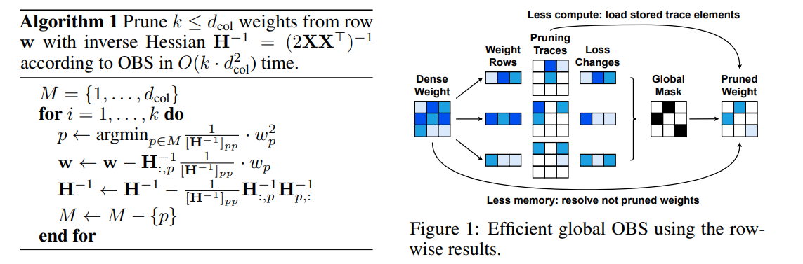

<figure class="paper-algorithm" aria-labelledby="obs-pruning-algorithm">
<figcaption id="obs-pruning-algorithm"><strong>Algorithm 1</strong> Optimal Brain Surgeon: Row-Wise Pruning</figcaption>

```math
\begin{array}{l}
\textbf{Require: }\text{weight row }\mathbf w,\quad k\le d_{\mathrm{col}},\quad
 \mathbf H^{-1}=(2\mathbf X\mathbf X^\top)^{-1}.\\[3pt]
\textbf{Cost: }O(k\,d_{\mathrm{col}}^2).\\[4pt]
M\leftarrow\{1,\ldots,d_{\mathrm{col}}\}\\[3pt]
\textbf{for }i=1,\ldots,k\ \textbf{do}\\[4pt]
\quad p\leftarrow\underset{p\in M}{\arg\min}\ \frac{w_p^2}{[\mathbf H^{-1}]_{pp}}\\[7pt]
\quad\mathbf w\leftarrow\mathbf w-\mathbf H^{-1}_{:,p}\frac{w_p}{[\mathbf H^{-1}]_{pp}}\\[7pt]
\quad\mathbf H^{-1}\leftarrow\mathbf H^{-1}-
 \frac{1}{[\mathbf H^{-1}]_{pp}}\mathbf H^{-1}_{:,p}\mathbf H^{-1}_{p,:}\\[7pt]
\quad M\leftarrow M\setminus\{p\}\\[3pt]
\textbf{end for}
\end{array}
```

</figure>

<figure class="algorithm-companion">
<span class="algorithm-image-crop" style="width:560px;aspect-ratio:571/377"></span>
</figure>
