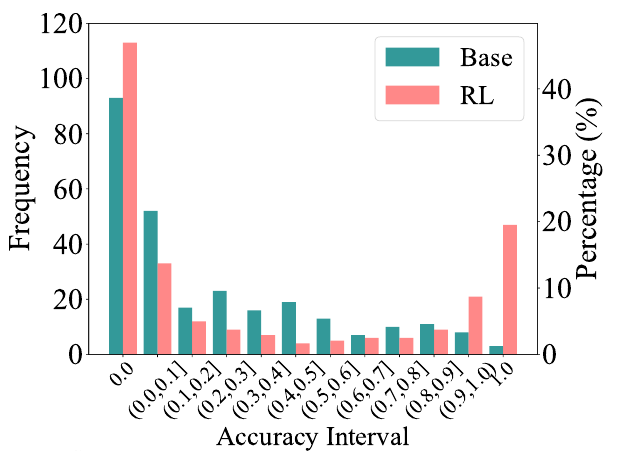
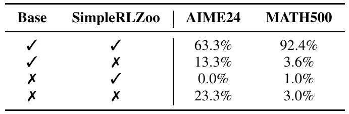
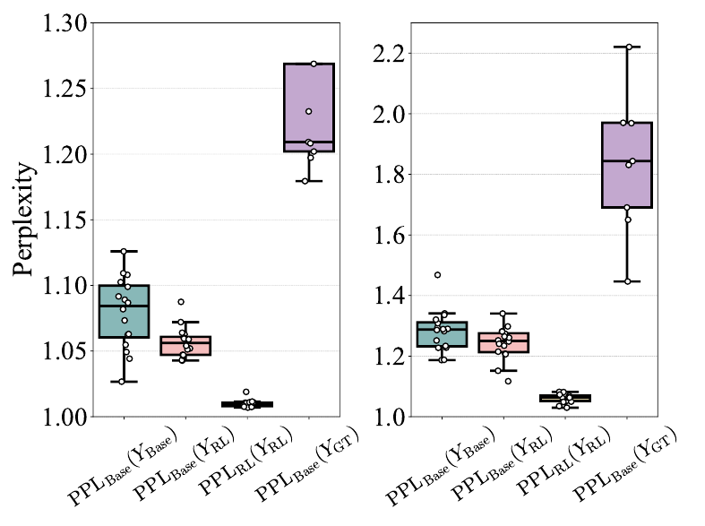
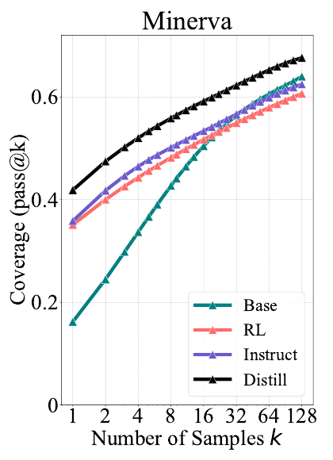
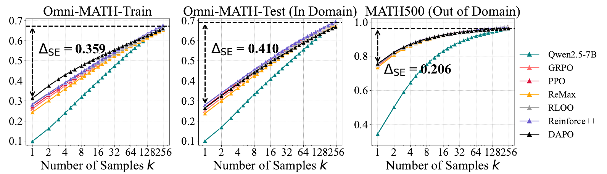
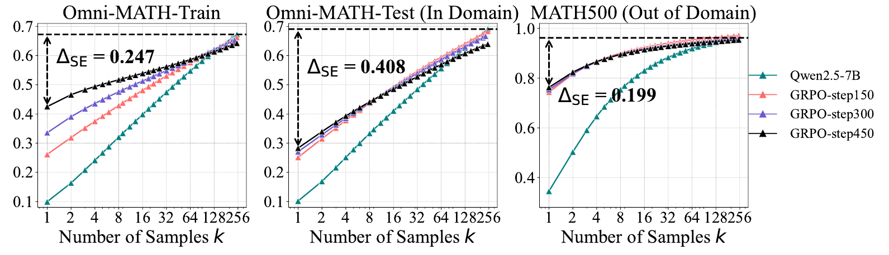
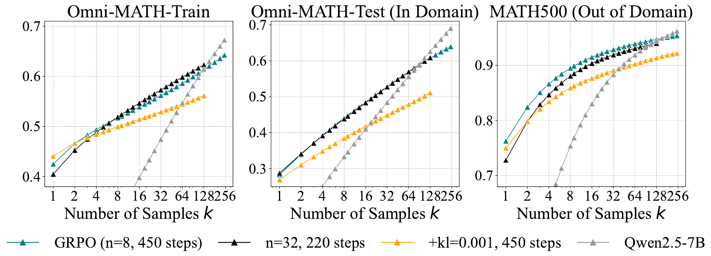
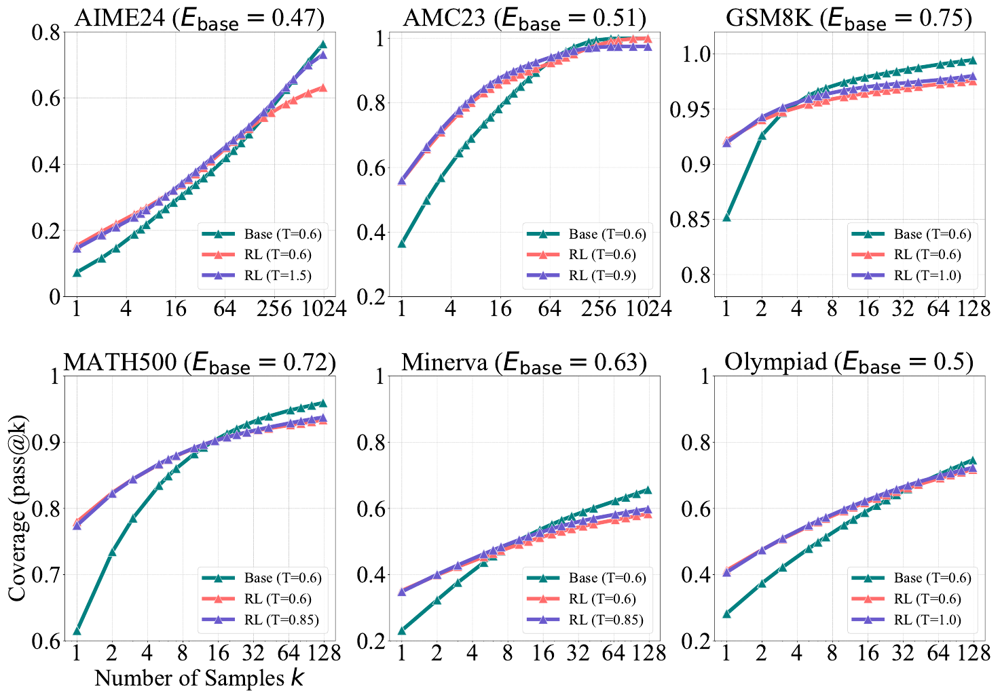
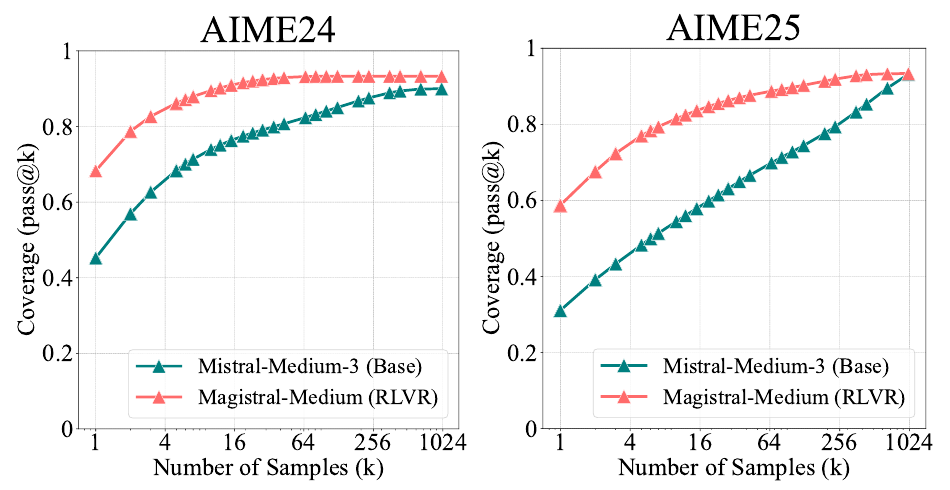

<h3 id="u7c422795">4.1 Reasoning Paths Already Present in Base Models</h3>

#### 准确率分布

- **现象：** RLVR 训练后，接近 1.0 的高准确率问题增多，中低准确率问题减少，但零准确率问题也增多
- **结论：** 平均表现的提升主要来自对已有可解问题更高效的正确路径采样，同时，更多问题在给定采样预算内未得到正确答案

<figure class="lake-figure" id="rlvr-accuracy-distribution" style="width:400px"></figure>

#### 可解问题集合

- **现象：** 在 AIME24（k = 1024）和 MATH500（k = 128）上，存在较多“基座模型可解、RL 模型不可解”的问题；反向情况很少，其中 AIME24 为 0%，MATH500 为 1%
- **结论：** 在这些评估设置下，RL 模型的可解问题集合近似包含于基座模型的可解问题集合，未观察到明显的覆盖范围扩展

<figure class="lake-figure" id="rlvr-solvable-coverage" style="width:520px"></figure>

#### 困惑度分析

- **现象：** RL 模型生成的回答在基座模型下的困惑度，接近基座模型自身回答困惑度分布的低值区域；随着 RL 训练推进，这一困惑度还会进一步下降
- **结论：** 这些 RL 推理路径在基座模型下本就具有较高似然，支持 RLVR 主要强化已有输出分布中的高奖励路径、使分布更加集中的解释

<figure class="lake-figure" id="rlvr-response-perplexity" style="width:550px"></figure>

<h3 id="u329d0bda">4.2 Distillation Expands the Reasoning Boundary</h3>

- **现象：** 使用更强教师模型生成的长 CoT 路径进行蒸馏后，学生模型的 pass@k 曲线在所测试的采样范围内持续高于基座模型；图中同时比较了指令微调和直接 RL 训练的结果
- **结论：** 蒸馏能够从教师模型引入新的推理模式，使学生模型突破原有推理覆盖范围；直接 RLVR 在该对照中未表现出相同效果

<figure class="lake-figure" id="rlvr-distillation" style="width:280px"></figure>

<h3 id="u40c414c0">4.3 Effects of Different RL Algorithms</h3>

- **现象：** 在统一实现与设置下，PPO、GRPO、Reinforce++、RLOO、ReMax 和 DAPO 的 pass@k 曲线差异有限。以基座模型的 pass@256 减去 RL 模型的 pass@1 衡量采样效率差距，域内测试集上的差距仍超过 40 个百分点
- **结论：** 现有算法虽然提高了单次采样的正确率，但距离充分利用基座模型的潜在能力仍有较大差距，算法间的变化未改变这一整体趋势

<figure class="lake-figure" id="rlvr-algorithms" style="width:800px"></figure>

<h3 id="u4a03435d">4.4 Effects of RL Training</h3>

#### 训练步数

- **现象：** 随着 RL 训练推进，训练集上的 pass@1 从 26.1% 提升至 42.5%，但 pass@256 逐步下降
- **结论：** 单次采样表现的改善与可解问题覆盖范围的收缩可以同时发生，训练更久并不必然扩大推理能力边界

<figure class="lake-figure" id="rlvr-training-steps" style="width:800px"></figure>

#### Rollout 数量

- **现象：** 每个问题的 rollout 数从 8 增至 32 后，大 k 下的覆盖率有所改善，但仍未超过基座模型。该设置每步计算量更大，受预算限制仅训练 220 步，而对照组训练 450 步
- **结论：** 增加 rollout 数量有助于提高大 k 下的覆盖率，但这一实验尚不能说明继续扩大 RL 训练规模能否突破基座模型的能力边界

#### KL 正则

- **现象：** 加入系数为 0.001 的 KL 惩罚后，pass@1 与不使用 KL 的 GRPO 相近，但 pass@128 明显降低
- **结论：** 在该设置下，KL 约束未改善单次采样表现，并进一步降低了大 k 下的可解问题覆盖率

<figure class="lake-figure" id="rlvr-rollout-kl" style="width:800px"></figure>

<h3 id="uac93e97b">4.5 Effects of Entropy</h3>

- **现象：** 提高 RL 模型的采样温度，使其输出熵接近温度为 0.6 的基座模型后，pass@k 略有改善，但在较大采样预算下仍未消除与基座模型的覆盖率差距
- **结论：** 输出熵下降是推理覆盖范围收缩的部分原因，但仅恢复输出多样性不足以完全解释或消除这一现象

<figure class="lake-figure" id="rlvr-matched-entropy" style="width:760px"></figure>

<h3 id="u9ef375f0">4.6 Effects of Model Size Scaling</h3>

- **现象：** 以 Mistral-Medium-3-2505 为起点、通过 RL 训练得到的 Magistral-Medium-2506，在 AIME24 和 AIME25 上表现出小 k 下的明显收益，但随着 k 增大，两者的 pass@k 差距逐渐缩小
- **结论：** 这一初步实验在更强的推理模型上观察到相似趋势。由于模型参数规模未公开，是否能通过进一步扩大模型规模或 RL 训练预算改变该趋势，仍有待验证

<figure class="lake-figure" id="rlvr-model-scaling" style="width:690px"></figure>
