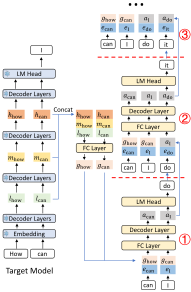

**草稿生成**

- **多层特征融合：** 以前缀 `How can` 为例，目标模型在预填充或上一轮验证中采样得到 `I`，同时提供低层、中层和高层特征 $`l`$、$`m`$、$`h`$。将三个 $`k`$ 维向量拼接后，经全连接层从 $`3k`$ 维投影到 $`k`$ 维，得到融合特征 $`g`$，其中 $`k`$ 为目标模型的隐藏维度
- **首个草稿 token：** 为生成以 `How can I` 为前缀的草稿，除复用 $`g_{\mathrm{how}}`$ 和 $`g_{\mathrm{can}}`$ 外，还引入已采样 token `I` 的嵌入 $`e_{\mathrm{I}}`$，使草稿模型获知采样结果。拼接后的向量经全连接层降至 $`k`$ 维，再输入单层解码器，得到输出 $`a_{\mathrm{I}}`$；随后通过目标模型的 LM head 采样得到 `do`
- **后续草稿 token：** `I` 尚未作为输入经过目标模型，因此没有对应的 $`g_{\mathrm{I}}`$。草稿模型以自身输出 $`a_{\mathrm{I}}`$ 替代该特征，并与 `do` 的嵌入 $`e_{\mathrm{do}}`$ 拼接，继续生成 $`a_{\mathrm{do}}`$ 和下一个草稿 token `it`。下一步再输入 $`a_{\mathrm{do}}`$ 与 $`e_{\mathrm{it}}`$，依此递推

<figure class="lake-figure" id="inference-pipeline"></figure>

**训练时测试**

- EAGLE-3 移除特征预测损失 $`l_{\mathrm{fea}}`$，通过 token 预测损失 $`l_{\mathrm{token}}`$ 训练草稿模型。其输入既包含目标模型的融合特征 $`g_1,g_2,\ldots,g_t`$，也包含草稿模型自身的输出 $`a_{t+1},a_{t+2},\ldots,a_{t+j}`$
- 训练时将生成的 $`a`$ 反馈至草稿模型，继续执行后续预测，使模型适应推理阶段的多步生成。草稿模型采用单个 Transformer 解码器层，其中自注意力需要根据各条生成路径的上下文调整掩码

**注意力掩码**

- 以 `How can I` 表示三个输入位置，初始注意力掩码为下三角矩阵。三个位置分别预测 `are`、`we` 和 `do`，对应 `How → are`、`How can → we` 和 `How can I → do` 三条上下文路径；这些输出之间没有顺序依赖
- 下一轮将这些预测位置的特征反馈为输入时，对原始训练数据的注意力仍遵循各自的前缀关系；对生成位置的注意力则只保留同一路径上的对应位置，因此各生成轮次之间的掩码块为对角矩阵。这些对角块可以用对应向量的点积计算，避免执行完整的矩阵乘法

<figure class="lake-figure" id="attention-masks"></figure>
