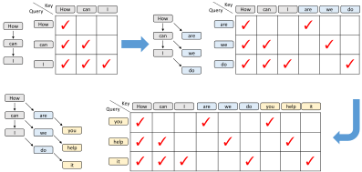

**草稿生成**

- **多层特征融合：** 以前缀 `How can` 为例，目标模型在预填充或上一轮验证中采样得到 `I`，同时提供低层、中层和高层特征 $`l`$、$`m`$、$`h`$。将三个 $`k`$ 维向量拼接后，经全连接层从 $`3k`$ 维投影到 $`k`$ 维，得到融合特征 $`g`$，其中 $`k`$ 为目标模型的隐藏维度
- **首个草稿 token：** 为生成以 `How can I` 为前缀的草稿，除复用 $`g_{\mathrm{how}}`$ 和 $`g_{\mathrm{can}}`$ 外，还引入已采样 token `I` 的嵌入 $`e_{\mathrm{I}}`$，使草稿模型获知采样结果。拼接后的向量经全连接层降至 $`k`$ 维，再输入单层解码器，得到输出 $`a_{\mathrm{I}}`$；随后通过目标模型的 LM head 采样得到 `do`
- **后续草稿 token：** `I` 尚未作为输入经过目标模型，因此没有对应的 $`g_{\mathrm{I}}`$。草稿模型以自身输出 $`a_{\mathrm{I}}`$ 替代该特征，并与 `do` 的嵌入 $`e_{\mathrm{do}}`$ 拼接，继续生成 $`a_{\mathrm{do}}`$ 和下一个草稿 token `it`。下一步再输入 $`a_{\mathrm{do}}`$ 与 $`e_{\mathrm{it}}`$，依此递推

<figure class="lake-figure" id="inference-pipeline"><a href="assets/images/inference-pipeline.svg?v=3d3f44cd05ad"></a></figure>

**训练时测试（Training-Time Test，TTT）**

- **原有特征预测约束：** EAGLE 同时优化特征预测损失 $`l_{\mathrm{fea}}`$ 与 token 预测损失 $`l_{\mathrm{token}}`$。特征回归使草稿输出接近目标模型的顶层特征，为多步自回归提供较一致的输入表示；但草稿模型必须同时满足特征拟合与 token 预测两个目标，额外的特征约束限制了其表达能力，以及从更大规模训练数据中获得的收益
- **移除约束后的分布偏移：** EAGLE-3 移除 $`l_{\mathrm{fea}}`$，仅保留 token 预测目标，草稿输出 $`a`$ 不再需要逼近目标模型的顶层特征。论文实验表明，仅移除约束并增加训练数据，能够提高第一个草稿 token 的接受率，但第二个 token 的接受率仍然很低：训练时输入真实特征，推理时却将自身输出作为后续输入，二者的表示分布可能显著不同
- **训练时测试：** TTT 在训练阶段模拟多步自回归生成，将草稿模型的输出重新送入输入端，使其直接学习处理目标模型特征 $`g`$ 与自身输出 $`a`$ 共同构成的上下文。各轮使用训练数据相应位置的 token 作为监督信号，通过 token 预测损失学习后续预测，而无需恢复顶层特征回归约束
- **数据规模扩展：** 移除特征约束提高了表示的自由度，TTT 则缓解了输出反馈引起的训练与推理分布偏移。结合多层特征融合，论文在所评估的数据规模范围内观察到：扩大草稿模型的训练数据量，可以进一步提升接受长度与推理加速比

```text 三轮草稿生成
目标模型：How can → f_can → LMHead → softmax → 采样 I
初始化：S = [g_How, g_can]，E = [e_can, e_I]

第 1 轮
  配对输入 = [(g_How, e_can), (g_can, e_I)]
  末位输出 a_I → LMHead → softmax → 采样 do
  更新 S = [g_How, g_can, a_I]，E = [e_can, e_I, e_do]

第 2 轮
  配对输入 = [(g_How, e_can), (g_can, e_I), (a_I, e_do)]
  末位输出 a_do → LMHead → softmax → 采样 it
  更新 S = [g_How, g_can, a_I, a_do]，E = [e_can, e_I, e_do, e_it]

第 3 轮
  在历史输入之后新增配对 (a_do, e_it)
  末位输出 a_it → LMHead → softmax → 采样下一个草稿 token
```

TTT 在训练中复现上述将自身输出连续反馈为输入的机制，使草稿模型适应由目标模型融合特征与自身隐状态共同构成的上下文

**注意力掩码**

- 以 `How can I` 表示三个输入位置，初始注意力掩码为下三角矩阵。三个位置分别预测 `are`、`we` 和 `do`，对应 `How → are`、`How can → we` 和 `How can I → do` 三条上下文路径；这些输出之间没有顺序依赖
- 下一轮将这些预测位置的特征反馈为输入时，对原始训练数据的注意力仍遵循各自的前缀关系；对生成位置的注意力则只保留同一路径上的对应位置，因此各生成轮次之间的掩码块为对角矩阵。这些对角块可以用对应向量的点积计算，避免执行完整的矩阵乘法

<figure class="lake-figure" id="attention-masks"><a href="assets/images/attention-masks.svg"></a></figure>
